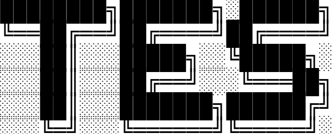

<p align="center">
  
</p>

# Tes Lang

Tes is dynamically typed interpreted object oriented programming language written in typescript

## Parser

Recursive Descent Parser

## Grammar

### Lexical Grammar

```
ALPHA          -> "a" ... "z" | "A" ... "Z" | "_" 
DIGIT          -> "0" ... "9" 
IDENTIFIER     -> ALPHA ( ALPHA | DIGIT )* 
NUMBER         -> DIGIT+ ( "." DIGIT+ )? 
STRING         -> "( any char except "\" )*" 
```